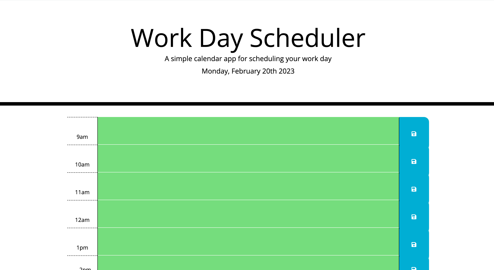
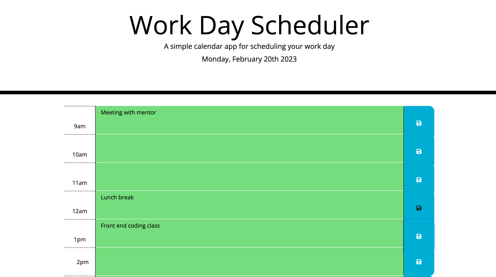

# Personal Daily Planner

## A simple calendar application that allows a user save events for each hour of the work day

## Overview

Designed as a single-service page, the daily planner shows the user text blocks representing their normal working hours (9am to 5pm). The blocks are color coded to indicate whether they're in the past(grey), present(red) or future(green).

The use can type anything they wish into each block and click the save icon next to that block to make the text persist on the page. 

😃 Use this planner to write down notes for your upcoming day! Click [here](https://ugopreneur.github.io/personal-daily-planner/) to try it out.

## Screenshots

#### Blank Daily planner

  

#### Planner with time bloicks filled in

  

## Built With

- Basic HTML to load the web page
- CSS for styling
- Intermediate-level Javascript for all logic: Arrays, Variables, methods, For Loops, nested for loops, Functions, nested functions, prompts, if/else statements, Manipulating HTML DOM, local storage etc.

## Contact

- Email: ugnwokoro@yahoo.com
- Twitter: https://twitter.com/ugopreneur
- LinkedIn: https://www.linkedin.com/in/ugonwokoro/ 
- Dev.to: https://dev.to/ugopreneur 

-----------------------------------------------------
## License
MIT License

Copyright (c) 2023 Ugo Nwokoro

Permission is hereby granted, free of charge, to any person obtaining a copy
of this software and associated documentation files (the "Software"), to deal
in the Software without restriction, including without limitation the rights
to use, copy, modify, merge, publish, distribute, sublicense, and/or sell
copies of the Software, and to permit persons to whom the Software is
furnished to do so, subject to the following conditions:

The above copyright notice and this permission notice shall be included in all
copies or substantial portions of the Software.

THE SOFTWARE IS PROVIDED "AS IS", WITHOUT WARRANTY OF ANY KIND, EXPRESS OR
IMPLIED, INCLUDING BUT NOT LIMITED TO THE WARRANTIES OF MERCHANTABILITY,
FITNESS FOR A PARTICULAR PURPOSE AND NONINFRINGEMENT. IN NO EVENT SHALL THE
AUTHORS OR COPYRIGHT HOLDERS BE LIABLE FOR ANY CLAIM, DAMAGES OR OTHER
LIABILITY, WHETHER IN AN ACTION OF CONTRACT, TORT OR OTHERWISE, ARISING FROM,
OUT OF OR IN CONNECTION WITH THE SOFTWARE OR THE USE OR OTHER DEALINGS IN THE
SOFTWARE.